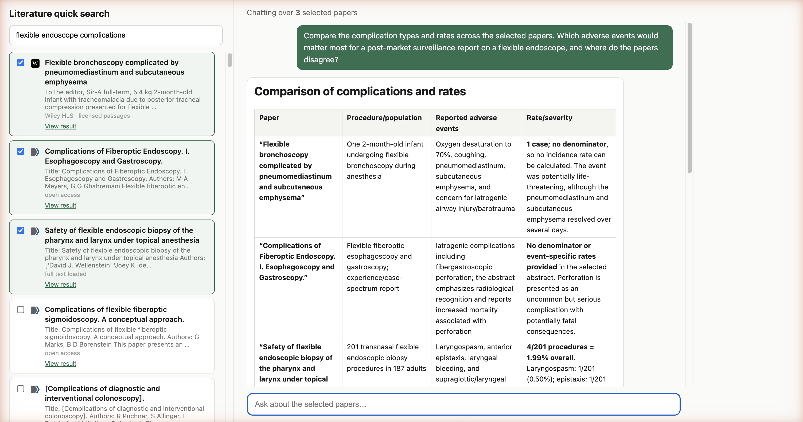

# Lit Chat Demo



Minimal literature search + chat demo built with Next.js, the Vercel AI SDK, and the [Valyu API](https://docs.valyu.ai).

**Flow:** quick search over PubMed plus paywalled journal sources (Wiley HLS, if your account has access) → select papers → chat grounded in exactly those papers. The model can also call Valyu search mid-conversation to pull new evidence.

How selected papers reach the model:

- Open-access paper → full text fetched via the Contents API and pinned into context
- Closed-access paper → abstract only
- Paywalled journal paper (e.g. Wiley HLS) → abstract + the relevant passages returned by search. Paywalled content is never scraped or fetched directly.

## Setup

```bash
pnpm install
```

Create `.env.local`:

```
VALYU_API_KEY=your_valyu_key      # platform.valyu.ai
OPENAI_API_KEY=your_openai_key   # or set ANTHROPIC_API_KEY to use Claude Sonnet 5
```

Run:

```bash
pnpm dev
```

Open http://localhost:3000, search a topic, tick some papers, and chat.

## Structure

- `app/api/search/route.ts` - literature search (PubMed + paywalled journals if you have access, 100 results)
- `app/api/fullpaper/route.ts` - full-text fetch for open-access papers
- `app/api/chat/route.ts` - streaming chat: pinned papers + Valyu as a tool call
- `app/page.tsx` - the whole UI

Model: Claude Sonnet 5 if `ANTHROPIC_API_KEY` is set, otherwise OpenAI `gpt-5.6-luna`. Swap in `app/api/chat/route.ts`.
